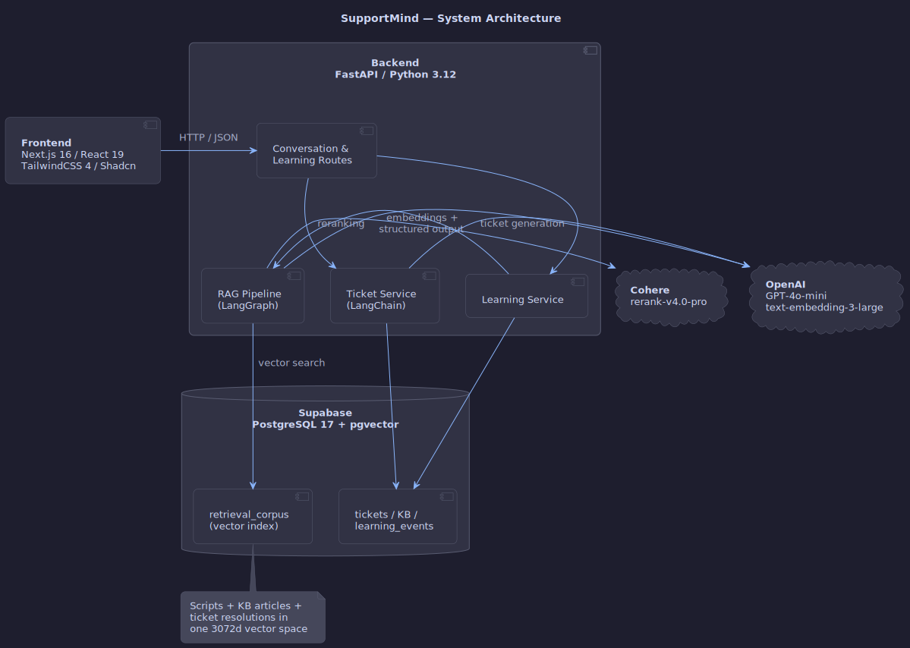

# SupportMind

**Hack-Nation 2026 | RealPage Sponsor Track**

---

## 🎬 Demo Video

*Click to watch the full demo on YouTube*

---

Support teams accumulate knowledge through resolved tickets, but that knowledge stays locked in closed conversations. Agents solve the same problems repeatedly because past resolutions never feed back into the tools they use.

SupportMind fixes this. When an agent closes a conversation, the system generates a structured ticket, compares the resolution against existing documentation, and drafts new KB articles when it finds gaps or outdated content. Those drafts go through human review, then become searchable for the next agent who hits the same issue.

## How It Works

1. **Agent clicks "Analyze"** — the system searches scripts, KB articles, and past ticket resolutions using vector similarity and reranking
2. **Agent resolves the issue** using the returned suggestions
3. **Conversation closes** — an LLM extracts root cause, resolution, and tags into a structured ticket
4. **Gap detection** — the resolution is compared against existing knowledge and classified: *confirmed*, *new gap*, or *contradicts* an existing article
5. **Human review** — approved drafts are embedded into the search index immediately; rejected ones are archived

Ticket #500 gets resolved. Ticket #501 gets better suggestions because of it.

## What's Different

- **Confidence scoring** — every retrieval outcome adjusts the source's ranking. Articles that consistently help agents surface higher; ones that don't, decay. This happens automatically from normal usage.
- **Contradiction detection** — when a resolution conflicts with an existing KB article, the system flags it and drafts a corrected version. Outdated documentation gets caught instead of lingering.
- **Full traceability** — every generated article links back to its source tickets and conversations through a lineage table. You can always trace why an article exists and what produced it.
- **Single search index** — scripts, KB articles, and ticket resolutions live in one vector index. One query searches all three.

## Tech Stack

| Layer | Tech |
|-------|------|
| Frontend | Next.js 16, React 19, TypeScript, TailwindCSS 4, Shadcn/ui |
| Backend | FastAPI, Python 3.12+, Pydantic 2.9+ |
| Database | Supabase PostgreSQL 17 + pgvector |
| Search & Generation | LangGraph, OpenAI GPT-4o-mini, text-embedding-3-large, Cohere rerank-v4.0-pro |

## Architecture

Source: <a href="docs/architecture.puml">architecture.puml</a>

## Setup & Testing

See [backend/README.md](backend/README.md) for environment variables, setup commands, and the full test matrix. See [frontend/README.md](frontend/README.md) for the UI.
