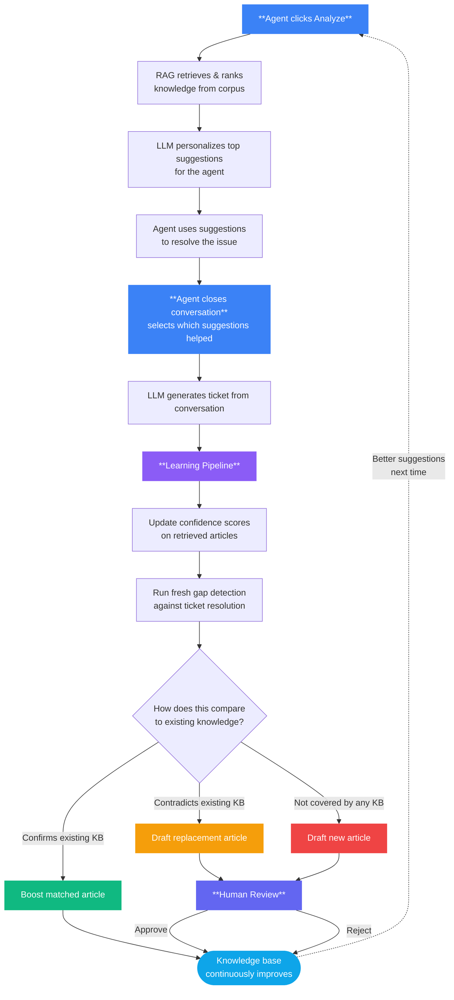

# SupportMind — System Flow

```mermaid
flowchart TD
    A["**Agent clicks Analyze**"] --> B["RAG retrieves & ranks<br/>knowledge from corpus"]
    B --> C["LLM personalizes top suggestions<br/>for the agent"]
    C --> D["Agent uses suggestions<br/>to resolve the issue"]

    D --> E["**Agent closes conversation**<br/>selects which suggestions helped"]
    E --> F["LLM generates ticket from conversation"]

    F --> G["**Learning Pipeline**"]
    G --> H["Update confidence scores<br/>on retrieved articles"]
    H --> I["Run fresh gap detection<br/>against ticket resolution"]

    I --> J{How does this compare<br/>to existing knowledge?}

    J -->|"Confirms existing KB"| K["Boost matched article"]
    J -->|"Contradicts existing KB"| L["Draft replacement article"]
    J -->|"Not covered by any KB"| M["Draft new article"]

    L --> N["**Human Review**"]
    M --> N

    K --> O(["Knowledge base<br/>continuously improves"])
    N -->|Approve| O
    N -->|Reject| O
    O -.->|"Better suggestions<br/>next time"| A

    style A fill:#3b82f6,color:#fff,stroke:none
    style E fill:#3b82f6,color:#fff,stroke:none
    style G fill:#8b5cf6,color:#fff,stroke:none
    style K fill:#10b981,color:#fff,stroke:none
    style L fill:#f59e0b,color:#fff,stroke:none
    style M fill:#ef4444,color:#fff,stroke:none
    style N fill:#6366f1,color:#fff,stroke:none
    style O fill:#0ea5e9,color:#fff,stroke:none
```
